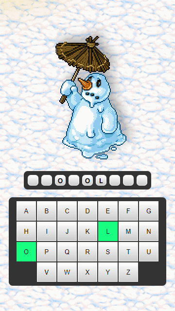
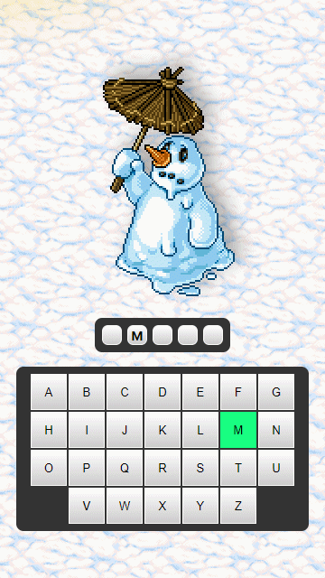
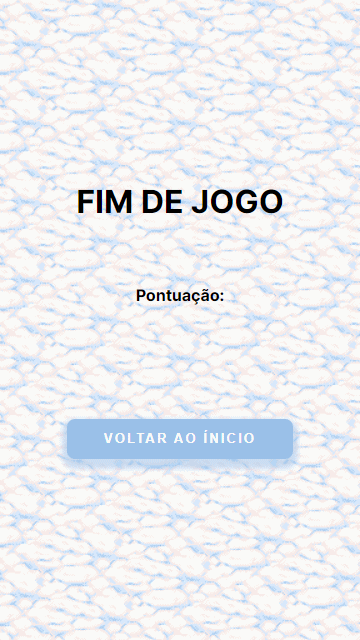
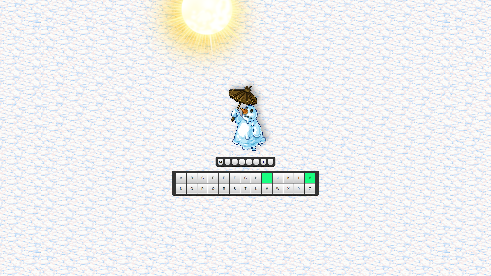

# Snowman Game ⛄

### Um mini-game similar ao jogo da forca, o jogador precisa acertar todas as letras pra formar a palavra, caso não consiga após 5 tentativas o boneco de neve derrete e o jogo acaba.

 

## Deploy

### https://alex-dmb.github.io/Snowman/ ❄️

 

## Stack

## Libs

- ### Howler.js (*Lib para tocar áudios no javascript*)
- ### Font Awesome (*Ícone de estrelas usada na tela de Score*)

 

## Mobile First 📱

 

### Tela Inicial
 

- 

 

### Acertando
 

- 

 

### Errando

 

- 

 

### Score

 

- 

 

- #### 0 Erros = 3 Estrelas
- #### 1 Erro = 2 Estrelas e Meia
- #### 2 Erros = 2 Estrelas
- #### 3 Erros = 1 Estrela e Meia
- #### 4 Erros = 1 Estrela
- #### 5 Erros = 0 Estrela

 

## Desktop 🖥️ 
 

-  